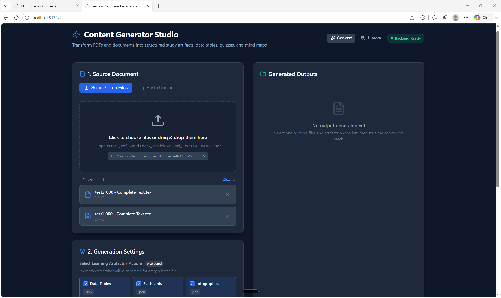
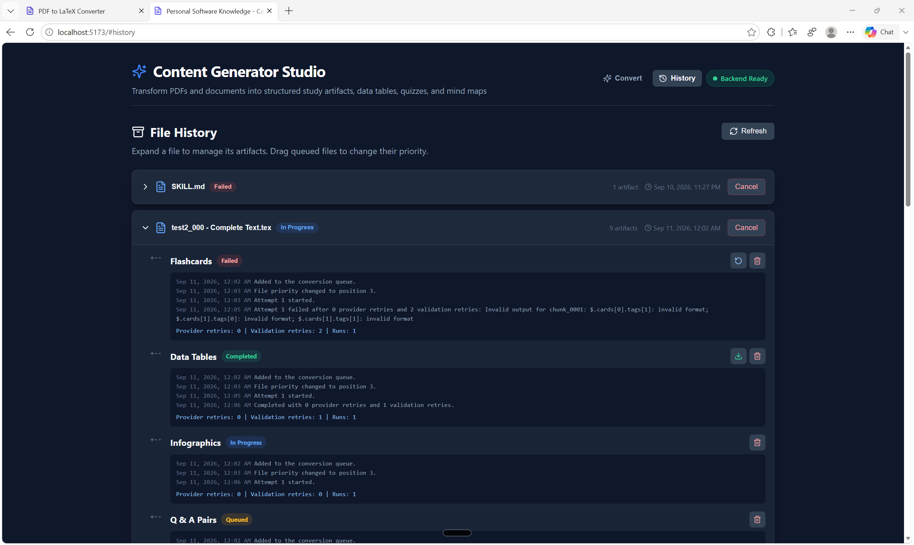

# Skill-Driven Python Content Generator

This Python 3.11+ application turns a source document into a learning artifact. Each
action is governed by the complete corresponding `skills/<name>/SKILL.md`; action
modules add only small task-specific context and contain no provider API code.

## Quickstart (Web UI & Backend)

### 1. Setup Environment
Automatically create the Python virtual environment (`.venv`), install backend dependencies, and install React frontend npm dependencies:

- **Windows**:
  ```cmd
  setup.bat
  ```
- **Linux / macOS**:
  ```bash
  chmod +x setup.sh run.sh
  ./setup.sh
  ```
*(Both scripts dispatch `setup.py`.)*

### 2. Run Application
Concurrently launch the FastAPI backend (`http://127.0.0.1:8000`) and the Vite React frontend (`http://localhost:5173`):

- **Windows**:
  ```cmd
  run.bat
  ```
- **Linux / macOS**:
  ```bash
  ./run.sh
  ```
*(Both scripts dispatch `run.py`.)*

On Windows, use `run_lan.bat` to allow access from other devices on your LAN.
It binds both servers to `0.0.0.0`, starting with UI port **5110** and API port
**8310**. Open `http://<your-PC-LAN-IP>:5110` on another device; if a port is busy,
use the actual port printed at startup. `run_lan.bat -Local` (also used by
`run_default.bat`) uses the same ports with access limited to this PC.
Set `FRONTEND_PORT` or `BACKEND_PORT` before launching to override these defaults.

Open your browser at **http://localhost:5173**. In the UI you can:
- **Select or drop multiple PDF files** (or Word, Markdown, plain text).
- **Paste PDF files** directly from your clipboard (or paste raw text).
- All 9 content-generation skills are selected by default; deselect any you do not need. Every selected artifact is generated for every selected source.
- The Connector is the default local provider. Select an active library model from the model picker, or refresh it after updating The Connector's configurations.
- Set an optional **Context window (tokens)** under Generation Settings for uploaded files or pasted content. Leave it blank for **Auto**.
- Upload a **Study-set ZIP** containing `study-set-config.json` and its input files to use configuration-driven generation from the UI.
- Persist each job in an isolated `conversion_history/` folder so completed and interrupted conversions survive restarts.
- Open **Global settings** in the header to set how many study-set artifact jobs can
  run at once (1–32, default 3). The setting is saved and restored after restarts.
- Open **File History** to expand each source into its artifact jobs, inspect retry logs,
  retry failures with a chosen character-based chunk size, cancel work, delete saved
  history, or download artifacts as ZIP archives. Select several files to download
  their study sets together. Queued files can be dragged to change priority.

## Web interface

The landing page is the starting point for a conversion. Add one or more source files,
select the learning artifacts to generate, choose a connector and model, then queue the
work. Each selected artifact is generated for every selected file.

**Context window (tokens)** supplies an optional positive integer token budget for
every conversion in the batch. With The Connector, saved configuration input
limits take precedence; this field applies when that input limit is unavailable.
Leaving it blank selects **Auto**, which uses the saved Connector limits when
available and otherwise an 8,192-token context budget. Other providers use their
existing model profile defaults when the field is blank. The selected setting is
saved with each job and reused when you retry it from File History.



Choose **Study-set ZIP**, select one archive, and click **Import study set** to run
the same configuration-driven batch as the CLI's `generate` command. Selecting or
dropping a ZIP in the normal upload tab also switches to this mode. Manual model,
artifact, format, context, and pipeline controls are disabled; the ZIP's
`study-set-config.json` supplies those settings, including per-entry overrides.

For example, package these files together:

```text
study-set-config.json
input/
  chapter-one.txt
  chapter-two.pdf
```

Use the [CLI configuration schema](#interactive-study-set-prompt), with a model
specified globally or for every `files` entry. An entry with `"input": "./input"`,
`"output": "./output"`, `"inputPattern": ["*.txt", "*.pdf"]`, and
`"types": ["podcast"]` queues a podcast for each of these files. The configured
`context_window` has the same precedence and 8,192-token Connector fallback as
CLI generation.

The configuration must be at the archive root or inside its single enclosing
folder. The backend extracts the ZIP into a new folder in the current user's
temporary directory and resolves paths from the configuration folder. Input,
output, work, and model-profile paths must stay inside that folder. ZIP uploads
are limited to 100 MiB, 512 MiB after extraction, 2,000 archive entries, and 1,000
configured jobs.

The complete package is validated before jobs are queued. Each matched file and
configured artifact/format appears in **File History**, using the configured
model. Sources, configuration, and job settings are saved with the jobs so retries
continue after temporary extraction files are removed. Provider credentials come
from the backend's environment, as they do in the CLI.

**File History** keeps related artifact jobs together under their source file. Expand a
file to see individual statuses and recent logs. Failed artifacts can be retried with a
custom character-based chunk size. Use **Delete history** to remove a file's saved
source, outputs, and artifact jobs; this also cancels any queued or active work for it.
Select several files (or use **Select all**), then click **Delete selected** to
remove their study sets after one confirmation. Queued and failed files can be
selected even when they have no saved output. Active jobs are canceled before
their files are removed. Unselected files and global settings are kept.
The **Cancel** action removes unfinished jobs while keeping completed artifacts.
Use **Download selected** to download the selected files with available output in
one ZIP, with a separate folder for each source. The toolbar shows how many selected
study sets can be downloaded.

Use the download button on a file to download its available study artifacts together,
even while other types are queued, running, or failed. The ZIP includes the source,
outputs and their metadata, plus a `manifest.json` listing the status of every
artifact at download time. Download again later to include newly completed types.
If a source chunk or final assembly fails after some chunks succeed, the successful
drafts are retained as a downloadable **partial output**. Partial outputs skip final
validation, stay marked as failed, and can be retried from saved checkpoints.
Complete outputs still go through the usual final validation.
Queued files can be moved higher or lower in the processing order by dragging them.

**Global settings** is available from both Convert and File History. Set
**Concurrent runs**, then click **OK** to save. The limit controls the total number
of queued artifact jobs processed at once across study sets. Raising it makes more
slots available; lowering it lets active jobs finish before more queued work starts.
Settings are stored in the SQLite database `conversion_history/settings.sqlite3`,
separately from artifact history, so deleting a file's history keeps your settings.



---

## Installation (CLI Mode)

Create and activate a virtual environment, then install the provider SDKs and binary
document readers:

```bash
python -m venv .venv
# Windows PowerShell
.venv\Scripts\Activate.ps1
python -m pip install -r requirements.txt
```

Copy `.env.example` to a private location or set the variables in your shell. The
application reads the process environment directly; it does not automatically load a
`.env` file and never stores credentials.

## Usage

### Interactive study-set prompt

Start the CLI without generation arguments:

```bash
python study_set.py
```

On Windows, the wrapper uses your active Python environment or the project's
`.venv` when available:

```cmd
study_set.bat
```

The prompt starts in the folder from which you launched it, displays the current
directory in the prompt, and keeps running until you enter `exit`. Press Tab to
complete commands or directory paths after `cd`, including quoted paths containing
spaces. If you installed dependencies before this feature was added, run
`python -m pip install -r requirements.txt` again to install the prompt dependency.
It supports these commands:

| Command | Behavior |
|---|---|
| `ls` | List files and folders in the current directory. |
| `cd PATH` | Change directory using an absolute or relative path, including `.` and `..`. Quote paths containing spaces. |
| `generate` | Read `study-set-config.json` from the current directory and generate all configured study sets. |
| `exit` | Close the prompt. |

For example, after starting the CLI:

```text
ls
cd "C:\Study Materials"
generate
cd ..
exit
```

Place `study-set-config.json` in the folder where you will run `generate`:

```json
{
  "model": "ACTIVE_LIBRARY_MODEL_ID",
  "context_window": 8192,
  "files": [
    {
      "input": "./input",
      "output": "./output",
      "inputPattern": "*.txt",
      "types": ["podcast"]
    }
  ],
  "verbose": true
}
```

Each `files` entry selects an input folder, output folder, matching file pattern,
and study-set types. `inputPattern` can also be a list, such as
`["*.txt", "*.pdf"]`. Relative paths are resolved from the configuration folder.
For each matching file and requested type, the CLI creates
`<output>/<input-stem>/<study-set-type>/<plural-type>.json`. For example,
`input/book.txt` with type `podcast` produces `output/book/podcast/podcasts.json`.
The input stem is the filename with its final extension removed.

Types are `datatable`, `flashcard`, `infographic`, `mindmap`, `podcast`, `qanda`,
`quiz`, `report`, and `slide`. Their plural forms and existing `create_*` action
names also work; output folders use the canonical singular type. JSON is the
default output format. An entry's `formats` must be supported by every requested
type; each result uses the corresponding filename extension.

| Study-set type | Supported formats |
|---|---|
| `datatable` | `json`, `csv` |
| `flashcard` | `json`, `txt` |
| `infographic` | `json`, `md`, `html`, `svg` |
| `mindmap` | `json`, `md`, `mmd` |
| `podcast` | `json`, `md` |
| `qanda`, `quiz` | `json` |
| `report` | `json`, `md`, `html` |
| `slide` | `json`, `md` |

The Connector is the default provider. Set a top-level `model` for all `files`
entries, or set `model` on each entry. An entry's `model` overrides the top-level
setting. Every entry must resolve to a nonblank model string; missing, `null`, and
blank models are rejected before generation begins. For The Connector, use an
active library model ID. An optional top-level `connector` selects another provider,
and an entry can override it for its own inputs. Optional top-level `pipeline`
settings use the existing option names in snake_case. A `files` entry can supply
its own `pipeline` object, which overrides individual top-level pipeline settings.

For The Connector, the CLI reads the selected saved configuration's
`gross_max_input_token` and `gross_max_output_token` limits before choosing its
chunk and request budgets. The input limit covers the complete prompt. The output
allowance uses the smaller of the saved output cap and the caller's requested
limit. These are separate caps. When an input cap is available, the operating context
budget is the input cap plus the output cap (or the default 2,048 output tokens if
no output cap is supplied), bounded by the model's advertised `context_length`
when available. Token estimates and safety margins still apply.

If no input cap can be discovered, `context_window` in `study-set-config.json`
supplies the fallback token budget; the default is 8,192. Set it at the top level
or on a `files` entry, or use the existing `pipeline.context_window` setting.
An entry's setting takes precedence over top-level settings; at the same level,
`pipeline.context_window` takes precedence over `context_window`. A discovered
input cap takes precedence over this local fallback, and a discovered output cap
still applies when the input cap is unavailable. Token limits must be positive
integers. The Connector's own configuration `context_window` counts recent
messages and is never used as a token budget. These operating settings do not
increase an upstream model's actual capacity.

For example, this configuration generates data tables in both JSON and CSV:

```json
{
  "connector": "the_connector",
  "model": "ACTIVE_LIBRARY_MODEL_ID",
  "pipeline": {
    "chunk_tokens": 12000,
    "max_output_tokens": 8000,
    "retries": 3,
    "checkpoint": true,
    "validate": true
  },
  "files": [
    {
      "input": "./input",
      "output": "./output",
      "inputPattern": ["*.txt", "*.pdf"],
      "types": ["datatable"],
      "formats": ["json", "csv"]
    }
  ],
  "verbose": false
}
```

The interactive CLI stores intermediate results and checkpoints in separate
folders for each input, study-set type, and output format under `tmp/study-sets/`.
Set `pipeline.work_dir` to choose a different parent folder for those job folders.

If the configuration is absent, `generate` reports
`study set config was not found`. Invalid commands, paths, configurations, and
generation failures report an error and return to the prompt so you can correct
the problem and try again.

With `verbose: true`, generation saves `run.log`, `requests/*.json`,
`responses/*.json`, and diagnostic `events/*.json` in a unique folder under the
system temporary directory's `personal-software-knowledge-src-log` folder
(`%TEMP%\personal-software-knowledge-src-log` on Windows). These logs retain the
supplied source, prompts, and generated content. Transport headers,
authentication, and explicit credential fields are omitted. Logs are saved even
with `pipeline.keep_raw` set to `false`; set `pipeline.force` to `true` to make new
provider requests when a run would otherwise resume cached results.

### Existing CLI forms

For one-shot generation, the existing orchestrator interface requires a connector,
input, action, and exact output path:

```bash
python orchestrator.py \
  --connector openai \
  --input "input/book1.pdf" \
  --action create_datatables \
  --output "tmp/output_20260907115400.txt"
```

Use `--model` to override the connector's environment/default model for one run:

```bash
python orchestrator.py \
  --connector ollama \
  --model llama3.2 \
  --input "input/book1.tex" \
  --action create_flashcards \
  --output "tmp/flashcards.txt"
```

Large inputs use a token-aware semantic chunk pipeline by default. The legacy command
shape remains valid; advanced controls are optional:

```bash
python orchestrator.py \
  --connector anthropic \
  --model MODEL_NAME \
  --input "input/Chapter 005. Variable Selection.txt" \
  --action create_qandas \
  --strategy multi_pass \
  --chunk-tokens 12000 \
  --chunk-overlap 500 \
  --max-output-tokens 8000 \
  --aggregation hierarchical \
  --retries 3 \
  --checkpoint \
  --validate \
  --keep-raw \
  --output "tmp/Chapter005/qandas/final.json"
```

`--model-profile profile.json`, `--context-window`, and
`--profile-max-output-tokens` let deployments provide verified limits for unknown or
locally configured models. `--force` regenerates completed stages but never overwrites
old raw responses. `--experiment NAME` loads one preset from `experiments/configs/`;
explicit flags take precedence.

Action modules are directly executable through the same shared runtime:

```bash
python create_qandas.py \
  --connector claude \
  --input "input/book1.md" \
  --output "tmp/qandas.json"
```

For these one-shot interfaces, `-v`/`--verbose` enables the same temporary
diagnostic logs described above.

The requested `--output` filename is never changed. Missing parent directories are
created automatically, the model response is not printed to the terminal, and output
is UTF-8. For skills that describe several related representations, run once per
desired output extension; the explicit destination tells the model which
representation to return.

If an output extension is not one of the skill's named formats (for example, a
data-table result requested as `.txt`), the prompt requests the skill's canonical
source-of-truth representation as plain UTF-8 text.

## Connectors

| Connector | Required configuration | Model setting/default |
|---|---|---|
| `the_connector` | running local The Connector backend; no API key | `THE_CONNECTOR_MODEL` / first discovered active library model |
| `openai` | `OPENAI_API_KEY` | `OPENAI_MODEL` / `gpt-4.1-mini` |
| `anthropic` / `claude` | `ANTHROPIC_API_KEY` | `ANTHROPIC_MODEL` / `claude-sonnet-4-5` |
| `openrouter` | `OPENROUTER_API_KEY` | `OPENROUTER_MODEL` / `openai/gpt-4.1-mini` |
| `ollama` | local Ollama server | `OLLAMA_MODEL` / `llama3.2` |

The Connector defaults to `http://127.0.0.1:8301/v1` (`THE_CONNECTOR_BASE_URL`).
The app discovers active saved configuration IDs with `GET /v1/models` and generates
study artifacts with `POST /v1/chat/completions`. Start The Connector and save/activate
at least one library configuration first. Use its library `model_id`, rather than a
raw upstream model name. Upstream credentials and routing remain in The Connector.
`THE_CONNECTOR_TIMEOUT` defaults to 600 seconds; model discovery uses at most 10 seconds.
The web UI proxies discovery through this app's backend, including for LAN clients.
The CLI resolves the selected library model ID to its display name through
`GET /v1/models`, then reads `GET /api/configuration/detail/{configuration-name}`
with the name URL-encoded. If the detail endpoint returns 404 or 409, it looks up
the exact `model_id` in `GET /api/configs` and reads that record's configuration.
If discovery is unavailable or the saved configuration omits its token caps,
the fallback budgets described above apply. To supply those caps, set positive
`gross_max_input_token` and `gross_max_output_token` values in the saved Connector
configuration. Library aliases use prompt-based JSON so optional provider
settings do not override the saved route.

For the interactive CLI, set `"connector": "the_connector"` and
`"model": "<active-library-model-id>"` in `study-set-config.json`. For one-shot
generation, use `--connector the_connector --model <active-library-model-id>`.
Only the one-shot interfaces allow omitting the model to use `THE_CONNECTOR_MODEL`
or discover the first active model. The interactive CLI requires the model in
`study-set-config.json`.
`config.yaml` now selects `the_connector` by default, with `url`, `model`, and `timeout`
settings in its `the_connector` section. Other providers remain selectable.

Ollama defaults to `http://localhost:11434` (`OLLAMA_BASE_URL`). Its request timeout is
controlled by `OLLAMA_TIMEOUT`. OpenRouter also supports `OPENROUTER_BASE_URL`,
`OPENROUTER_HTTP_REFERER`, and `OPENROUTER_APP_NAME`.

Provider failures, rate limits, unavailable models, and context-limit errors use exit
code 6 in one-shot CLIs; the interactive CLI reports errors and keeps running.
Provider exception bodies are not echoed because SDK errors can contain prompt
text or sensitive request details.

## Actions

| Action | Authoritative skill |
|---|---|
| `create_datatables` | `skills/datatables/SKILL.md` |
| `create_flashcards` | `skills/flashcards/SKILL.md` |
| `create_infographics` | `skills/infographics/SKILL.md` |
| `create_mindmaps` | `skills/mindmaps/SKILL.md` |
| `create_podcasts` | `skills/podcast-script/SKILL.md` (legacy supplied folder name) |
| `create_qandas` | `skills/qandas/SKILL.md` |
| `create_quizzes` | `skills/quizzes/SKILL.md` |
| `create_reports` | `skills/reports/SKILL.md` |
| `create_slides` | `skills/slides/SKILL.md` |

Podcasts produce exactly one self-contained episode per study set, with an estimated
runtime of at most 45 minutes at 150 dialogue words per minute plus explicit pauses.
Long sources are summarized to fit; there is no minimum length. Chunked podcast
drafts use a final model assembly pass even with `--aggregation deterministic` so
the episode has one introduction and sign-off. Overlong results fail validation.

## Input formats

Supported formats are `.txt`, `.md`, `.markdown`, `.tex`, `.rst`, `.json`, `.csv`,
`.html`, `.htm`, `.pdf`, and `.docx`. Plain text and LaTeX are decoded without
rewriting mathematical notation. PDF extraction retains page markers; DOCX extraction
retains headings, lists, and tables where the document structure exposes them.

The loader is a registry. Add a new format without modifying the orchestrator:

```python
from pathlib import Path
from document_loader import register_loader

@register_loader(".custom")
def load_custom(path: Path) -> str:
    return path.read_text(encoding="utf-8")
```

Documents are split losslessly at chapters, sections, exercises, paragraphs, lists,
tables, and token-based fallbacks. Code fences, LaTeX environments/equations, tables,
lists, and recognized exercise blocks are atomic whenever they fit the verified model
budget. Oversized protected blocks fail explicitly instead of being silently cut.

## Architecture

- `study_set.py` runs the persistent study-set prompt and configuration-based generation.
- `orchestrator.py` parses and coordinates the one-shot CLI.
- `cli_runtime.py` holds reusable generation dispatch logic for CLI entry points.
- `document_loader.py` extracts normalized source text.
- `skill_loader.py` reads the complete authoritative skill.
- `action_base.py` constructs the grounded prompt shared by the small `create_*.py`
  modules.
- `connectors/` contains all provider-specific code behind `LLMConnector`.
- `pipeline/` contains model profiles, token budgeting, semantic chunking, normalized
  extraction, capped exponential retry/recovery, hierarchical aggregation, checkpoints,
  provenance, and validation.
- `experiment.py` and `experiments/` define reproducible strategy/model comparisons;
  see [experiments/README.md](experiments/README.md).
- `result_processor.py` removes accidental whole-response code fences and validates
  `.json` output before it is written.
- `output_writer.py` writes only to the caller's requested destination.

Intermediates are written to `tmp/<source>/<artifact>/` by default (or `--work-dir`):
source chunks and metadata under `chunks/`, per-chunk extractions/artifacts, append-only
request/response evidence under `raw/`, aggregation tree nodes, validation metrics, and
`checkpoint.json`. Restarts reuse only content-addressed complete stages; changed source,
skill, model, profile, or generation settings invalidate the relevant checkpoint.

API failures retry by default until a successful response is received. Delays follow
`1s, 2s, 4s, 8s, ... 64s, 128s, 240s, 240s, ...`. For HTTP 400, 413, or 422 responses,
the next four attempts use a smaller prompt and output budget; the second attempt also
falls back from provider-side JSON formatting while retaining the JSON instruction. If
all four variants are rejected, the pipeline regenerates that stage from smaller source
chunks. Authentication and authorization failures, plus local token-budget errors,
remain terminal. Use `--retries N` when a finite retry limit is required; `--retries 0`
disables provider retries.

## Batch generation from `config.yaml`

Use `main.py` to run every action for source files in `input/` that are not listed in
`.checkpoint.json`'s `completed` array:

```bash
python main.py
python main.py --dry-run
python main.py --actions create_flashcards create_qandas
```

`main.py` resolves `${ENVIRONMENT_VARIABLE}` values in the selected provider's
configuration before starting child processes. This lets one `config.yaml` retain
credentials placeholders for several providers without requiring keys for providers
that are not selected. It reads `provider.default` (or the compatible
`default.provider`) to select the connector, maps that provider's YAML settings into
the connector environment variables, and then invokes `orchestrator.py` once per
unfinished source/action pair.

For one input source, all actions share a timestamp. Output paths use
`tmp/output_<action>_<YYYYMMDDHHmmss>.txt`, keeping the nine responses separate rather
than overwriting one `output_<timestamp>.txt` file. The version-2 batch checkpoint is
atomically saved before and after every artifact. It records completed artifacts for each
source plus the artifact work folder, pre-separated chunk paths, next chunk number, and
completed chunk outputs. Every artifact folder also has its own content-addressed
`checkpoint.json`, updated after each successful chunk. Version-1 checkpoints whose
`in_progress` field is a list of filenames are migrated on load. A failed or interrupted
run resumes the unfinished artifact and reuses its valid chunk outputs.

The batch checkpoint uses this shape (chunk text is stored in the referenced files):

```json
{
  "version": 2,
  "completed": ["Chapter 003. Statistical Learning.txt"],
  "in_progress": {
    "Chapter 004. Linear Regression.txt": {
      "timestamp": "20260909190548",
      "completed": ["datatables", "flashcards"],
      "in_progress": {
        "infographics": {
          "status": "in_progress",
          "folder": "tmp/Chapter 004. Linear Regression/infographics",
          "checkpoint": "tmp/Chapter 004. Linear Regression/infographics/checkpoint.json",
          "text": ["chunks/chunk_0001.txt", "chunks/chunk_0002.txt"],
          "current_at": 2,
          "outputs": ["artifacts/generated/chunk_0001.json"]
        }
      }
    }
  }
}
```

## Exit codes

These codes apply to the orchestrator and directly executable action modules.
Command errors in the interactive prompt do not end the session; `exit` closes it
successfully.

| Code | Meaning |
|---:|---|
| 0 | Success |
| 1 | Unexpected/general failure or interruption |
| 2 | Invalid CLI argument, action, or connector |
| 3 | Missing, unsupported, unreadable, or empty input |
| 4 | Missing or unreadable skill file |
| 5 | Missing connector configuration or SDK |
| 6 | Provider/API or invalid model-response failure |
| 7 | Output directory/file write failure |
